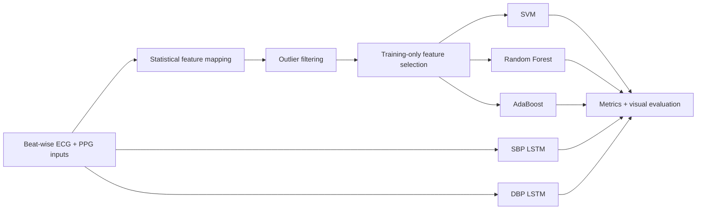

# Cuffless Blood Pressure Estimation from ECG and PPG Signals

A research pipeline for beat-wise systolic and diastolic blood pressure
estimation from synchronized photoplethysmography (PPG) and
electrocardiography (ECG) signals.

The project compares two modeling strategies:
- **Statistical feature branch:** feature mapping -> outlier filtering -> training-only feature selection -> Various ML models.
- **Deep learning branch:** two independent bidirectional LSTM models, one for systolic blood pressure (SBP) and one for diastolic blood pressure (DBP).

## Pipeline



The SBP and DBP LSTMs do not share parameters or losses. This avoids
cross-target interference while keeping both models on the same reproducible
train/validation split.

## Features

- Reproducible beat-level data shuffling with a configurable random seed.
- Physiological and IQR-based SBP/DBP outlier filtering.
- Statistical ECG/PPG descriptors, derivative statistics, peak information,
  signal correlation, and ECG-to-PPG peak lag.
- Feature ranking performed on the training partition only.
- SVM, Random Forest, and AdaBoost regression baselines.
- Separate single-target SBP and DBP bidirectional LSTMs.
- Common evaluation with RMSE, MAE, overall MAE, R-squared, true-versus-
  predicted plots, and Bland-Altman plots.
- Visualization notebooks that read saved results without retraining models.

## Repository Structure

```text
.
├── assets/
│   └── benchmark_metrics.csv
├── data/
│   └── README.md
├── models/    
├── notebooks/
│   ├── adaboost_results.ipynb
│   ├── lstm_results.ipynb
│   ├── random_forest_results.ipynb
│   └── svm_results.ipynb
├── outputs/   
├── src/cuffless_bp/
│   ├── cli.py
│   ├── config.py
│   ├── data.py
│   ├── evaluation.py
│   ├── features.py
│   ├── models.py
│   ├── notebook.py
│   └── pipeline.py
├── tests/
├── pyproject.toml
├── requirements.txt
└── train.py
```

## Installation

Python 3.10 or newer is required.

```bash
python -m venv .venv
source .venv/bin/activate
python -m pip install --upgrade pip
python -m pip install -r requirements.txt
```

## Data

Waveform data and derived NumPy arrays are intentionally excluded from the repository.
You can use the data in MIMIC, or under the public repo https://github.com/thamolwanpo/estimateBP/tree/master/data.
Place the five required files in `data/`:

```text
x_main.npy   # (n_train, beat_length, 2): PPG and ECG channels
y_main.npy   # (n_train, 2): normalized [SBP, DBP]
x_test.npy   # (n_test, beat_length, 2)
y_test.npy   # (n_test, 2)
min_max.npy  # training-set normalization dictionary
```

See [`data/README.md`](data/README.md) for the complete schema. The current
local dataset contains beat-wise arrays with a maximum sequence length of 200.
Migration to MIMIC waveform data is planned, but MIMIC data is not distributed
with this repository.

## Training

Run the complete comparison once from the repository root:

```bash
python train.py
```

Train only one branch of the project:

```bash
python train.py --skip-lstm
```
or
```bash
python train.py --skip-traditional --epochs 30
```

The feature mapping CSV files are large and are therefore not saved by
default. Add `--save-feature-mapping` only when row-level feature inspection is
needed.

The models are trained sequentially by the command above; "parallel branches"
describes the comparison design, not simultaneous execution. Opening a results
notebook does **not** retrain any model.

## Outputs

Every method uses the same output contract:

```text
outputs/<method>/
├── metrics.csv
├── predictions.csv
├── true_vs_predicted.png
├── bland_altman_sbp.png
└── bland_altman_dbp.png
```

## Visualization

After training, open the notebook for the method of interest:

```bash
jupyter notebook notebooks/random_forest_results.ipynb
```

Each notebook displays the saved metric table, prediction samples,
true-versus-predicted plots, and separate SBP/DBP Bland-Altman plots. The
notebooks are visualization-only so results can be reviewed repeatedly without
accidental retraining.

## Preliminary Results

The following archived reference run used the current local beat-level dataset.
It is preliminary, is not a clinical validation, and predates the final
training-only feature-selection safeguard in this packaged version.

| Method | SBP RMSE | DBP RMSE | SBP MAE | DBP MAE | Overall MAE | SBP R2 | DBP R2 |
|---|---:|---:|---:|---:|---:|---:|---:|
| SVM | 12.912 | 3.889 | 10.828 | 3.084 | 6.956 | 0.217 | 0.806 |
| Random Forest | **6.199** | **3.261** | **4.684** | **2.295** | **3.490** | **0.820** | **0.863** |
| AdaBoost | 12.686 | 4.542 | 10.952 | 3.812 | 7.382 | 0.245 | 0.735 |
| Separated LSTM | 8.541 | 3.682 | 7.108 | 2.878 | 4.993 | 0.658 | 0.826 |

The full-precision values are available in
[`assets/benchmark_metrics.csv`](assets/benchmark_metrics.csv).
